# Cube Labs 3D Architecture

## Product shape

Cube Labs 3D is a mobile-first Next.js application centered on playable digital puzzles, guided solvers, learning content, Cube ID profiles, social challenges, leaderboards, managed advertising, and administration.

## Architectural layers

```text
UI pages and reusable components
        ↓
Cube Labs application services
        ↓
Provider adapters
        ↓
Supabase / PostgreSQL / storage / email / realtime
```

Visual pages must not depend directly on Supabase-specific behavior. They call application services such as:

- `getCurrentUser()`
- `getProfile()`
- `saveSolve()`
- `createChallenge()`
- `getLeaderboard()`
- `getActiveAds()`
- `deleteUser()`

Provider-specific implementations should remain isolated under a dedicated data/provider boundary.

## Shared page systems

Public pages should use shared site layout components:

- site header;
- mobile bottom navigation;
- footer;
- managed ad slots;
- managed carousels;
- affiliate product cards;
- consistent page shells and spacing.

Admin pages use a separate protected admin layout.

## Cube systems

Puzzle rendering and puzzle logic should remain separable where practical:

- engine/state model;
- move notation and serialization;
- solver integration;
- Three.js renderer;
- touch/gesture resolver;
- timers, undo, scramble history, and solve reporting.

The working 3×3 interaction is the reference experience for other cube sizes. Larger cubes require camera zoom, panning, accurate layer selection, and stable viewport positioning without changing the approved 3×3 behavior.

Skewb follows the same separation on draft PR #9:

- `lib/skewb-engine.ts` owns renderer-independent 120° corner/center state,
  notation, solved checks, scrambles, and verified state search;
- `app/SkewbGame.tsx` owns fourteen Three.js piece bodies, layer picking,
  continuous drag preview, camera mode, and animation;
- every committed visual turn resolves back to the engine's discrete state;
- all eight physical corner pivots remain selectable after arbitrary move
  sequences.

### Shared puzzle result and friend-play contract

`components/UniversalPuzzleActions.tsx` is the shared account-facing action
surface. Puzzle renderers provide a start state and, where supported, a
renderer-independent `PuzzleAttemptSnapshot`. `lib/puzzle-attempt.ts` validates
the snapshot and builds API payloads containing:

- puzzle type and exact scramble/start state;
- elapsed time and move count;
- undo, touch, and button metrics;
- move history and assistance flags;
- the optional sender solve ID attached to a friend challenge.

Renderers do not write directly to Supabase. The shared component calls the
existing solve, solver-memory, and challenge APIs. Auto-solved/assisted attempts
cannot be saved as legitimate completed results. This contract is implemented
for Skewb on PR #9 and is the target for other puzzle engines as their native
attempt data becomes available.

## Managed content

Ads and promotional content attach to pages through named placements, for example:

- `home_top_banner`
- `home_carousel`
- `solver_top_banner`
- `solver_product_carousel`
- `learn_mid_banner`
- `leaderboard_sponsor`
- `profile_promo`

Pages render shared components such as `AdSlot` and `ManagedCarousel`; campaign content is selected from the database by placement, schedule, status, and priority.

## Core data domains

The platform is expected to contain ordinary PostgreSQL tables for:

- profiles and Cube IDs;
- solves and solve statistics;
- friendships and friend requests;
- challenges and challenge attempts;
- reusable scrambles and scramble attempts;
- saved solver snapshots and cube-state memory;
- leaderboard entries and ranking snapshots;
- achievements and collections;
- notifications and activity;
- ads, campaigns, placements, slides, and affiliate products;
- admin roles and permissions;
- audit logs;
- feature flags and site settings.

Test records must include an explicit test marker and remain excluded from public rankings and production analytics by default.

## Authentication

Current authentication uses Supabase email/password auth with HTTP-only cookies. Recovery links must target an allowlisted production or preview reset route. Authentication provider details must remain isolated so another auth provider can be introduced later.

## Admin security boundary

The browser is never trusted for privileged actions. Admin operations must:

1. validate the active session;
2. verify role and permission server-side;
3. validate request data;
4. perform the action through a protected server route or server action;
5. write an audit record;
6. return only necessary information.

### Admin platform (implemented — see ADR 0003)

The `/admin` platform implements the boundary as concrete layers:

```text
components/admin/* , app/admin/**            (UI)
        ↓
app/admin/actions/* , app/api/admin/*        (protected server actions / routes)
        ↓
lib/admin/*                                  (administration services)
        ↓
lib/admin/service-client.ts                  (service-role adapter, server-only)
        ↓
Supabase / PostgreSQL / Auth
```

- Gate: `app/admin/layout.tsx` → `requireAdmin()`; each page → `requirePermission()`;
  each action/route → `authorizeAction()`.
- Authorization store: `admin_members` (never profile/user metadata).
- Audit: append-only `admin_audit_log`, redacted before write.
- Service-role key is server-only (`SUPABASE_SERVICE_ROLE_KEY`, never `NEXT_PUBLIC_*`)
  and the layer fails closed when unconfigured.
- Migration: `supabase/migrations/20260723_admin_platform.sql`.
- Security detail is consolidated below; admin operations live in
  `docs/ADMIN-PORTAL.md`, and contributor rules live in `docs/GOVERNANCE.md`.

## Structural change process

Any major restructuring requires:

- owner approval;
- a numbered architecture decision in `docs/DECISIONS.md`;
- an update to this document;
- changelog entry;
- migration and rollback notes;
- verification that approved page layouts and cube behavior remain intact.

## Platform boundaries and operations

Authentication, security, backup, and migration rules are consolidated here
because they define platform boundaries. Operators should use the admin section
in `ADMIN-PORTAL.md` for day-to-day procedures.

---

## Authentication

> Consolidated from `docs/AUTHENTICATION.md` on 2026-07-27. The source path remains
> recorded here so repository history can recover the exact earlier file.

<!-- BEGIN CONSOLIDATED SOURCE: docs/AUTHENTICATION.md -->
# Cube Labs 3D Authentication

Authoritative reference for Cube ID login, sessions, recovery, and how the admin
platform reuses this system. Referenced by `docs/README.md`.

**Status reviewed 2026-07-27:** the code is merged into `main`; production
migration confirmation, SES delivery/recovery proof, real OAuth providers, and
full suspension/session invalidation remain open.

## Model

- **Provider:** Supabase Auth (email/password today; OAuth gateway parked at
  `/auth/provider/*`).
- **Sessions:** HTTP-only cookies `cubelabs_access_token` + `cubelabs_refresh_token`
  set by server actions (`app/auth/actions.ts`, `app/lib/supabase-rest.ts`).
  `secure` in production, `sameSite=lax`, `path=/`.
- **Server actions** (`signIn`, `signUp`, `requestPasswordReset`, `signOut`) are
  the only writers of auth cookies. The browser never sees tokens in JS.
- **Profile identity** (`display_name`, `cube_tag`, `public_slug`) is generated
  by the `ensure_profile_identity` trigger (see `20260722_cube_id_platform.sql`).

## Email links

`getSiteOrigin()` prefers `NEXT_PUBLIC_SITE_URL`, then the real request origin,
then a production fallback — never a single hard-coded preview URL. Every origin
used must be listed in Supabase Auth → URL Configuration → Redirect URLs.

## Admin authentication

The admin platform **reuses** this session, it does not add a competing system:

1. `lib/admin/auth.ts#resolveAdmin` reads `cubelabs_access_token`.
2. It validates the token against `GET /auth/v1/user` with the user's own token.
3. It looks up an **active, unexpired** `admin_members` row via the service role.
4. `requireAdmin` (server components) redirects failures; `authorizeAction`
   (server actions / routes) throws so a security event can be recorded.

Authorization lives in `admin_members` — **never** in editable profile fields or
client-controlled user metadata.

### Owner bootstrap

After the first owner account exists, run once in the Supabase SQL editor:

```sql
select public.bootstrap_owner('you@example.com');
```

This inserts/updates a single `owner` row in `admin_members`. Additional admins
are added by the Owner through `roles.manage` (owner-only).

## Support-initiated recovery

`/admin/users/[id]` can request a password-reset email for a user
(`requestPasswordResetFor`). The action logs the target and action only — **never**
the recovery link or token.

## Open items

- Confirm `20260722_cube_id_platform.sql` + `20260722_cube_labs_mail_foundation.sql`
  are applied in production (ROADMAP §2).
- AWS SES production delivery verification + runbook (ROADMAP §2).
- Real Google/Apple/GitHub OAuth wiring.
- Session invalidation on suspend is best-effort via Auth ban; full token
  revocation depends on Supabase support and is not yet verified.
<!-- END CONSOLIDATED SOURCE: docs/AUTHENTICATION.md -->

---

## Security

> Consolidated from `docs/SECURITY.md` on 2026-07-27. The source path remains
> recorded here so repository history can recover the exact earlier file.

<!-- BEGIN CONSOLIDATED SOURCE: docs/SECURITY.md -->
# Cube Labs 3D Security

This document is the authoritative security reference for the admin platform and
the surrounding application. It is referenced by `docs/README.md`.

**Status reviewed 2026-07-27:** the documented admin boundary and hardening code
are merged into `main`. Production migration/RLS proof, rate limits, admin
step-up authentication, dependency remediation, secret scanning, and
two-account challenge authorization tests remain open.

## Security boundary

**The browser is never the security boundary.** Every protected page and every
privileged operation independently validates on the server:

1. Read + validate the server-side session (HTTP-only cookie → Supabase Auth).
2. Confirm an **active, unexpired** `admin_members` row (`requireAdmin`).
3. Verify the required permission server-side (`requirePermission` / `authorizeAction`).
4. Validate and normalize all input.
5. Perform the operation through a protected server action or route handler.
6. Write an audit record (values redacted).
7. Return only the minimum necessary data.
8. **Fail closed** when auth, config, or permission checks are unavailable.

Never trusted from the browser: role, permission, account ownership, user id,
premium state, test-data state, leaderboard eligibility, previous DB value,
campaign approval state, challenge result, audit identity.

## Service-role usage

- The Supabase **service-role key** bypasses RLS and is used **only** in
  server-only code (`lib/admin/service-client.ts`, guarded by `import "server-only"`)
  **after** `requireAdmin`/`requirePermission` has passed.
- It is read from `SUPABASE_SERVICE_ROLE_KEY` — **never** `NEXT_PUBLIC_*`.
- `isAdminConfigured()` fails closed (throws `AdminConfigError`) when the key is
  absent, so the admin surface never silently degrades to an unprivileged path.

## Roles & permissions

Centralized in `lib/admin/permissions.ts`. Roles: `owner`, `admin`, `moderator`,
`editor`, `support`, `analyst`. `permissionsForRole` is derived from
`hasPermission` so the listed grant can never diverge from the effective grant.

Owner-only (`OWNER_ONLY`): `roles.manage`, `users.delete`, `leaderboards.reset`,
`settings.manage`, `migration.manage`, `test_data.display_mode`. These are
denied to every non-owner role even if a future edit mislists them.

## Audit & redaction

- `admin_audit_log` is **append-only** — no UPDATE/DELETE policy exists, so even
  a leaked user token cannot tamper with history.
- `lib/admin/redact.ts` strips sensitive keys (password, token, secret,
  service-role, authorization, cookie, refresh/access token, recovery, otp,
  smtp, credential) and JWT-looking strings before any insert. This is unit
  tested (`tests/redact.test.ts`).
- Never logged: passwords, access/refresh tokens, SMTP credentials, service-role
  keys, full recovery links, unnecessary private auth metadata.

## RLS model

Every admin table has RLS **enabled with no permissive anon/user policy** — deny
by default. Privileged reads/writes go through the service role. Public read
policies exist **only** where a public page legitimately needs data (live
campaigns/carousels/slides, active affiliate products, public non-secret
settings). Authenticated users may only *insert* a moderation report; they
cannot read the queue.

### RLS verification checklist

Run in the Supabase SQL editor / advisor after applying `20260723_admin_platform.sql`:

- [ ] `admin_members`, `admin_audit_log`, `admin_security_events`, `site_settings`,
      `feature_flags`, `test_runs`, `ad_campaigns`, `ad_carousels`,
      `ad_carousel_slides`, `affiliate_products`, `moderation_reports` all report
      **RLS enabled** in the Supabase advisor.
- [ ] An anonymous client cannot `select` from `admin_members` or `admin_audit_log`.
- [ ] An ordinary authenticated client cannot read the audit log or security events.
- [ ] An ordinary authenticated client cannot update/delete an audit row.
- [ ] Public leaderboard queries (`is_test=false & leaderboard_eligible=true`)
      exclude every test-run solve.
- [ ] `select public.bootstrap_owner('you@example.com')` creates exactly one owner.
- [ ] Supabase Auth **leaked-password protection is enabled** (dashboard setting).

## Automated vs manual verification

The Security Center (`/admin/security`) labels each finding **Passed / Warning /
Failed / Unavailable / Manual check required** and never claims automated
verification where only a manual check was possible. RLS-enabled state, storage
policies, and the leaked-password setting are **manual** because they cannot be
introspected through the REST API.

## Hardening applied

- Next.js is pinned to the patched 14.2 line (`14.2.35` as of this merge).
- Global security headers and CSP are configured in `next.config.mjs`.
- `force-dynamic` + `no-store` on all admin routes (never statically cached).
- Origin check (`assertSameOrigin`) on privileged mutations (defense in depth on
  top of Next's server-action CSRF protection).
- Input size limits and safe-URL validation (`http/https` only) block
  `javascript:`, `data:`, `file:` destinations.
- Typed-phrase confirmation + mandatory reason on destructive actions.

## Known open items

- Rate limiting on sensitive endpoints is **not yet implemented** (tracked in
  ROADMAP §8). Origin checks and size limits are in place.
- Admin step-up 2FA/TOTP is **not yet implemented**.
- `npm audit --omit=dev` still reports unresolved dependency findings. The
  safe path bumped Next to `14.2.35`; full remediation requires a planned
  framework-major upgrade and replacement or deeper review of `cubejs`, whose
  current package bundles an old `npm` dependency.
- Production RLS/advisor verification must be run and recorded once the migration
  is applied (see checklist above).
<!-- END CONSOLIDATED SOURCE: docs/SECURITY.md -->

---

## Backup and migration

> Consolidated from `docs/BACKUP-AND-MIGRATION.md` on 2026-07-27. The source path remains
> recorded here so repository history can recover the exact earlier file.

<!-- BEGIN CONSOLIDATED SOURCE: docs/BACKUP-AND-MIGRATION.md -->
# Backup and Migration

## Goal

Cube Labs must be able to leave Supabase or split services across providers without rebuilding the product UI.

## Provider independence

Application pages use Cube Labs service functions rather than direct provider calls. Supabase-specific database, authentication, storage, and realtime code stays behind adapters.

Public Cube IDs must not depend on provider-generated user IDs.

## Portable data

Keep core product data in ordinary PostgreSQL tables wherever possible:

- profiles and public Cube IDs;
- solves and statistics;
- friendships and friend requests;
- challenges and attempts;
- leaderboard records;
- achievements and collections;
- notifications;
- ads, placements, campaigns, and carousel slides;
- affiliate products;
- admin roles and audit logs;
- site settings and feature flags.

Schema migrations must be committed to GitHub and remain sufficient to rebuild the database structure.

## Harder migration areas

### Authentication

Export users and supported password hashes when possible. A change to a different authentication system may require staged account migration or password resets. Sessions and JWT signing keys must be handled separately from database rows.

### Storage

Avatars, ad media, tutorial assets, and videos must be copied to the replacement object-storage provider. Store stable asset metadata rather than scattering provider-specific URLs throughout components.

### Realtime

Online presence, live notifications, and live challenges may require a replacement WebSocket or realtime service. Persistent challenge and friendship data remains in PostgreSQL.

## Backup requirements

Maintain:

- scheduled PostgreSQL backups;
- periodic verified restore tests;
- exports of authentication users where supported;
- inventory and backup of storage objects;
- committed database migrations;
- environment-variable inventory without secret values;
- current deployment and DNS notes;
- documented recovery steps.

## Admin migration tools

The admin portal should eventually provide owner-only export tools for:

- users and profiles;
- solves and statistics;
- friendships and challenges;
- leaderboards;
- content and learning material;
- ads and affiliate campaigns;
- settings;
- audit logs.

Exports must be access-controlled and audited.

## Migration options

1. Self-host Supabase while retaining similar APIs.
2. Move PostgreSQL to another managed provider and replace Auth, Storage, and Realtime independently.
3. Keep Supabase Auth while moving high-volume data or media elsewhere.
4. Keep the database while moving images and videos to lower-cost object storage and a CDN.

## Migration procedure

A production migration requires:

1. complete inventory of data and provider features;
2. current backups and successful restore test;
3. migration rehearsal in a non-production environment;
4. data validation counts and checksums where practical;
5. authentication and redirect testing;
6. storage URL migration;
7. security and RLS review;
8. documented cutover and rollback windows;
9. post-cutover monitoring;
10. update to architecture, changelog, and a decision record.

## Prohibited coupling

Do not:

- call Supabase directly from every page;
- use storage-provider URLs as permanent identifiers;
- rely on provider dashboards as the only schema history;
- omit backups of admin content and affiliate campaigns;
- treat a successful export as a verified backup without testing restoration.
<!-- END CONSOLIDATED SOURCE: docs/BACKUP-AND-MIGRATION.md -->


<!-- BEGIN CONSOLIDATED SOURCE: docs/DEPENDENCY-GRAPHS.md -->

> Consolidated from `docs/DEPENDENCY-GRAPHS.md` on 2026-07-27 during the Skewb reconciliation merge. This is the cross-referenced visual dependency, data-flow, state-ownership, security, testing, and documentation map, owned by ARCHITECTURE. Links were flattened to plain text; some referenced the pre-consolidation documentation structure (owners are listed in `README.md`).

# Cube Labs 3D Dependency Graphs

This is the canonical visual map of Cube Labs 3D dependencies, data flow, state ownership, and documentation relationships.

It complements, but does not replace:

- README.md — documentation index and workflow;
- CONSTITUTION.md — non-negotiable project rules;
- VISION.md — product direction;
- ARCHITECTURE.md — authoritative system boundaries;
- CODING-STANDARDS.md — project implementation rules;
- SOFTWARE-ENGINEERING-BEST-PRACTICES.md — general engineering principles;
- AI-INSTRUCTIONS.md — required AI contributor workflow;
- CURRENT_STATUS.md, PROJECT-HEALTH.md, ROADMAP.md, DAILY-LOG.md, and CHANGELOG.md — current truth, evidence, priorities, and history.

Specialized contracts remain authoritative in CUBE-ENGINE.md, AUTHENTICATION.md, SOCIAL-AND-MULTIPLAYER.md, ADS-AFFILIATES.md, ADMIN-PORTAL.md, ADMIN-GUIDE.md, SECURITY.md, BACKUP-AND-MIGRATION.md, and decisions/.

Historical checkpoints and root-level handoff notes are evidence, not competing architecture. Fold durable conclusions into permanent documents and preserve the originals for history.

## 1. Documentation dependency graph

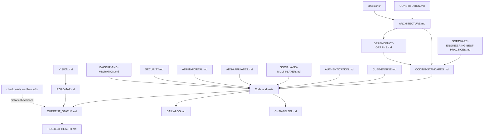

**Rule:** when two documents disagree, resolve the conflict immediately. The permanent specialized document owns its subject; `CURRENT_STATUS.md` owns what is true now.

## 2. Whole-system dependency graph

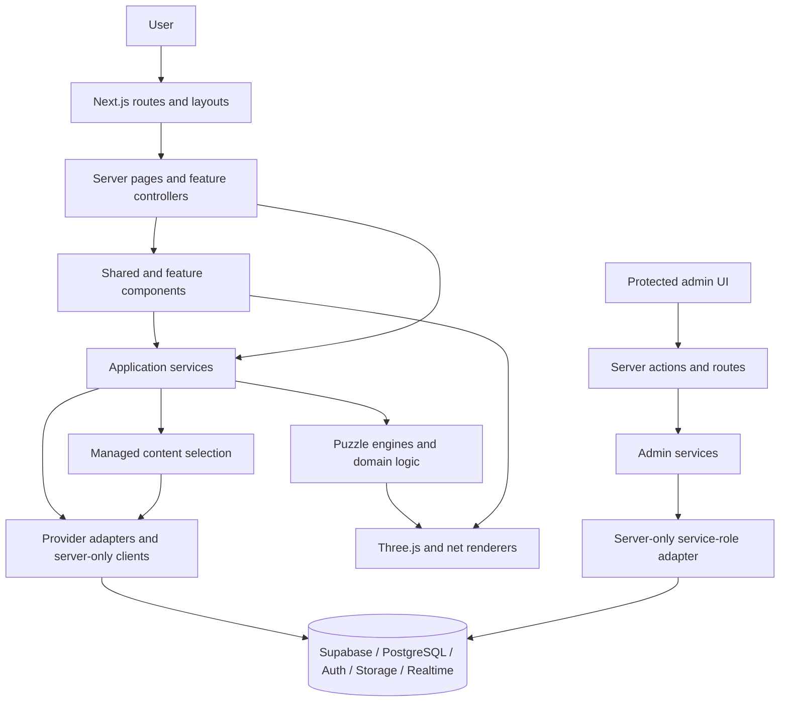

Dependencies flow downward. UI must not bypass services to reach privileged providers. Engines must not import React, navigation, advertising, account state, or database clients. See ARCHITECTURE.md and CODING-STANDARDS.md.

## 3. Public page composition graph

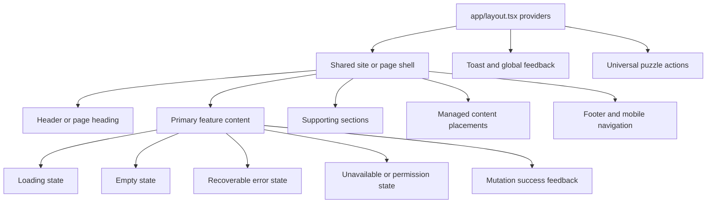

Every visible route and CTA must resolve. Shared shells, tokens, controls, and states are defined in CODING-STANDARDS.md.

## 4. Puzzle dependency graph

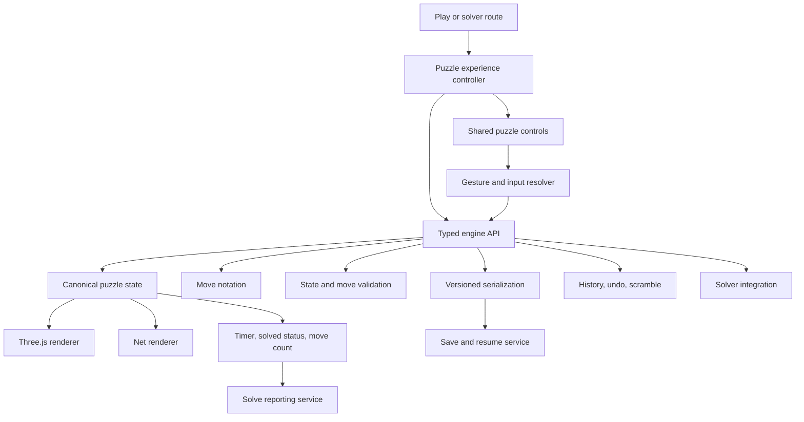

The engine is the source of puzzle truth. Renderers display state; they do not maintain a competing permutation model. The approved 3×3 interaction is the reference behavior. See CUBE-ENGINE.md, engine-specific notes, and engine tests under `tests/`.

## 5. Puzzle family and reuse graph

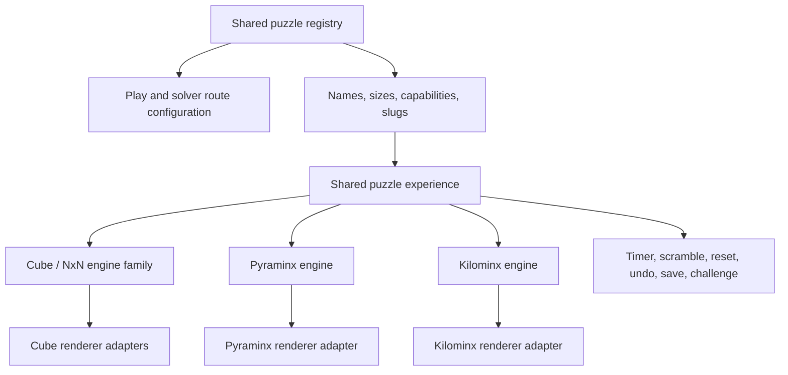

New puzzles extend the registry, engine contract, renderer adapter, tests, and route configuration. Do not clone a complete game page. Cross-reference CUBE-ENGINE.md, `lib/cube-engine.ts`, `lib/nxn-cube.ts`, `lib/nxn-fast.ts`, `lib/pyraminx-engine.ts`, `lib/kilominx-engine.ts`, and related tests.

## 6. Authentication and Cube ID flow

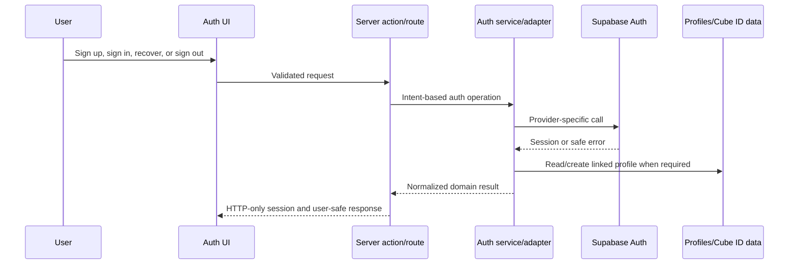

Provider details stay isolated and recovery redirects must be allowlisted. See AUTHENTICATION.md, SECURITY.md, and BACKUP-AND-MIGRATION.md.

## 7. Solve, scramble, challenge, and leaderboard flow

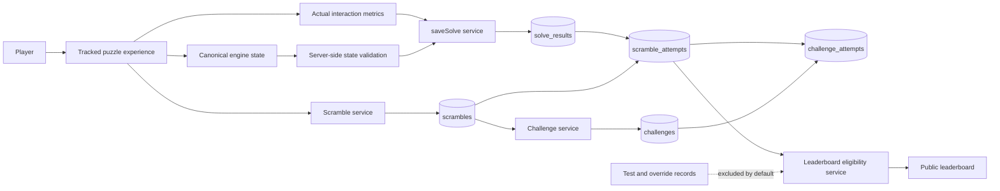

Actual and reported/test metrics remain separate. Public ranking eligibility is a server decision. See SOCIAL-AND-MULTIPLAYER.md, SECURITY.md, current checkpoints, and leaderboard handoff material.

## 8. Managed ads and affiliate content flow

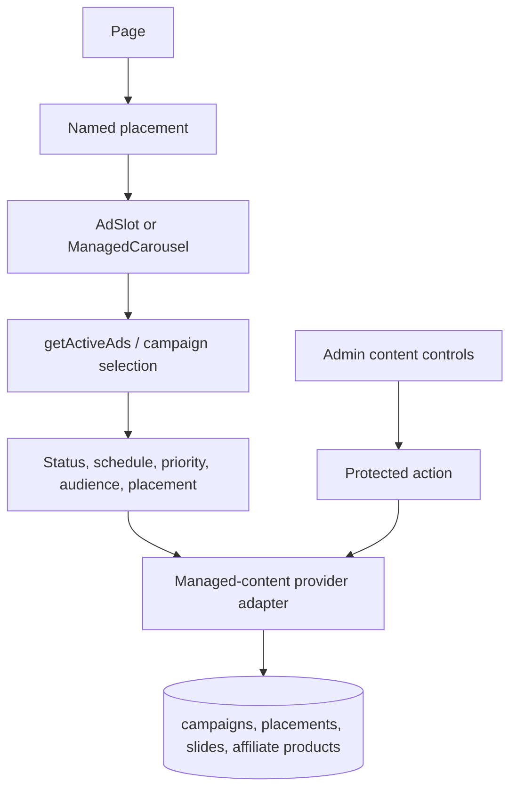

Pages reference placements; they do not hard-code campaign content. See ADS-AFFILIATES.md, ADMIN-PORTAL.md, and campaign selection tests.

## 9. Admin security dependency graph

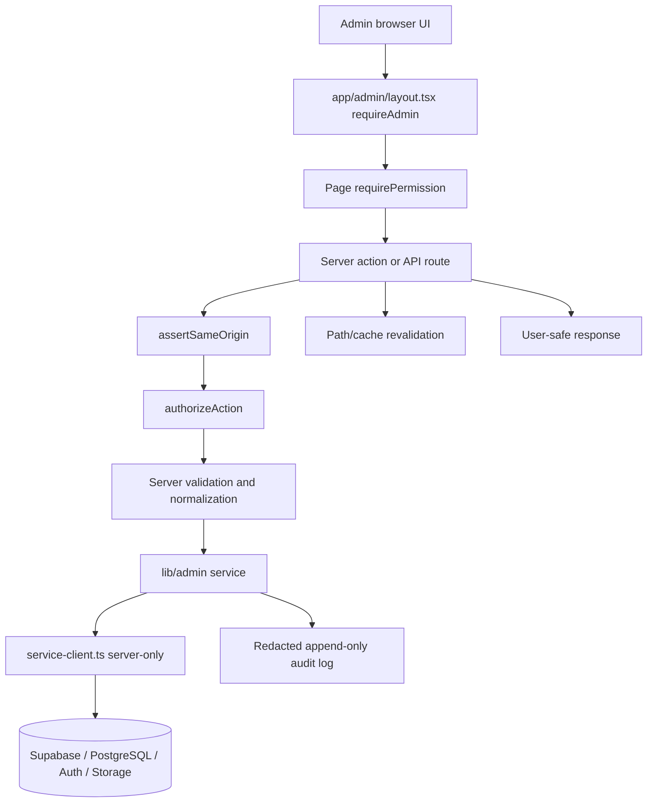

The browser is never trusted for privilege. Authorization lives in `admin_members`, service-role credentials are server-only, and failures close safely. See ADMIN-PORTAL.md, ADMIN-GUIDE.md, SECURITY.md, and ADR 0003.

## 10. State ownership graph

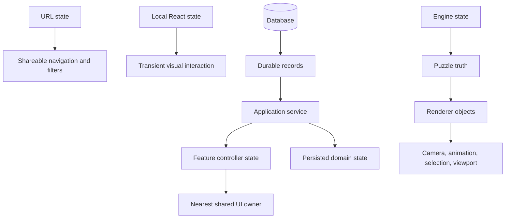

Do not mirror one source of truth across React state, render objects, engine state, and persistence without a documented synchronization contract.

## 11. Testing and proof dependency graph

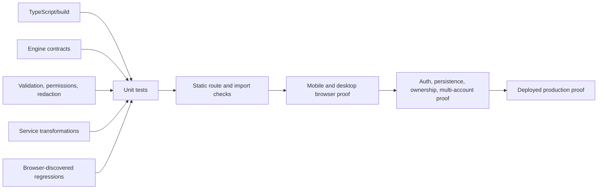

A lower proof level never establishes a higher one. See CODING-STANDARDS.md, PROJECT-HEALTH.md, DAILY-LOG.md, and `tests/`.

## 12. Change and context-rot control graph

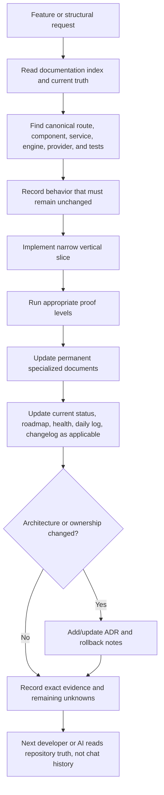

See AI-INSTRUCTIONS.md, README.md, CODING-STANDARDS.md, and checkpoints/.

## 13. Import-direction rules

Allowed direction:

```text
app routes/layouts
  -> feature controllers/components
    -> shared components/hooks/types
      -> application/domain services
        -> engines and pure domain modules
        -> provider adapters/server-only clients
          -> external systems
```

Forbidden examples:

- provider adapter importing a page or React component;
- engine importing UI, auth, ads, database, or navigation;
- shared component importing a route-specific page module;
- visual component importing service-role or privileged Supabase code;
- feature A deep-importing feature B internals;
- renderer mutating canonical puzzle state independently;
- route file becoming a second service, engine, or design system.

## 14. Living-graph maintenance rules

Update this document when any of these change:

- a new architectural layer, provider, engine family, major data domain, or shared state owner is introduced;
- an existing dependency direction changes;
- a route family or feature flow becomes canonical;
- authentication, authorization, persistence, managed content, or public ranking flow changes;
- a diagram no longer matches the code.

For every graph change:

1. update the specialized permanent document first;
2. update this visual map;
3. add an ADR when the change is structural or difficult to reverse;
4. update current-status and evidence documents as required by README.md;
5. preserve historical checkpoints rather than rewriting them as current truth.

## 15. Automated graph generation target

The Mermaid diagrams above are curated architectural intent. They should eventually be supplemented by generated evidence:

- TypeScript import graph with circular-dependency detection;
- route inventory and broken-link check;
- package dependency audit;
- database relationship diagram generated from migrations/schema;
- test-to-module coverage map;
- client/server boundary check;
- forbidden-import boundary check.

Generated graphs report what the code currently does. This document reports what the architecture permits. A mismatch is a defect to investigate, not a reason to silently edit the intended architecture.

<!-- END CONSOLIDATED SOURCE: docs/DEPENDENCY-GRAPHS.md -->
