# Cube Labs 3D Dependency Graphs

This is the canonical visual map of Cube Labs 3D dependencies, data flow, state ownership, and documentation relationships.

It complements, but does not replace:

- [README.md](./README.md) — documentation index and workflow;
- [CONSTITUTION.md](./CONSTITUTION.md) — non-negotiable project rules;
- [VISION.md](./VISION.md) — product direction;
- [ARCHITECTURE.md](./ARCHITECTURE.md) — authoritative system boundaries;
- [CODING-STANDARDS.md](./CODING-STANDARDS.md) — project implementation rules;
- [SOFTWARE-ENGINEERING-BEST-PRACTICES.md](./SOFTWARE-ENGINEERING-BEST-PRACTICES.md) — general engineering principles;
- [AI-INSTRUCTIONS.md](./AI-INSTRUCTIONS.md) — required AI contributor workflow;
- [CURRENT_STATUS.md](./CURRENT_STATUS.md), [PROJECT-HEALTH.md](./PROJECT-HEALTH.md), [ROADMAP.md](./ROADMAP.md), [DAILY-LOG.md](./DAILY-LOG.md), and [CHANGELOG.md](./CHANGELOG.md) — current truth, evidence, priorities, and history.

Specialized contracts remain authoritative in [CUBE-ENGINE.md](./CUBE-ENGINE.md), [AUTHENTICATION.md](./AUTHENTICATION.md), [SOCIAL-AND-MULTIPLAYER.md](./SOCIAL-AND-MULTIPLAYER.md), [ADS-AFFILIATES.md](./ADS-AFFILIATES.md), [ADMIN-PORTAL.md](./ADMIN-PORTAL.md), [ADMIN-GUIDE.md](./ADMIN-GUIDE.md), [SECURITY.md](./SECURITY.md), [BACKUP-AND-MIGRATION.md](./BACKUP-AND-MIGRATION.md), and [decisions/](./decisions/).

Historical checkpoints and root-level handoff notes are evidence, not competing architecture. Fold durable conclusions into permanent documents and preserve the originals for history.

## 1. Documentation dependency graph

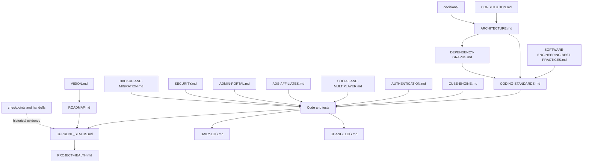

**Rule:** when two documents disagree, resolve the conflict immediately. The permanent specialized document owns its subject; `CURRENT_STATUS.md` owns what is true now.

## 2. Whole-system dependency graph

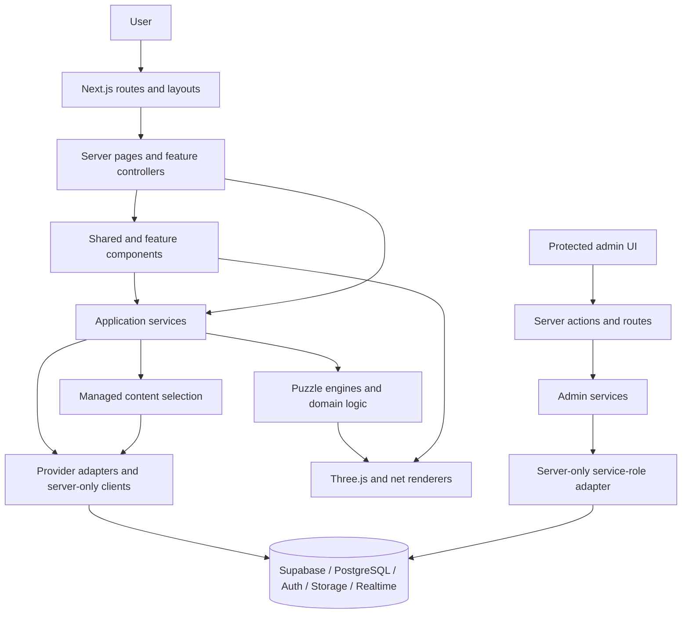

Dependencies flow downward. UI must not bypass services to reach privileged providers. Engines must not import React, navigation, advertising, account state, or database clients. See [ARCHITECTURE.md](./ARCHITECTURE.md) and [CODING-STANDARDS.md](./CODING-STANDARDS.md).

## 3. Public page composition graph

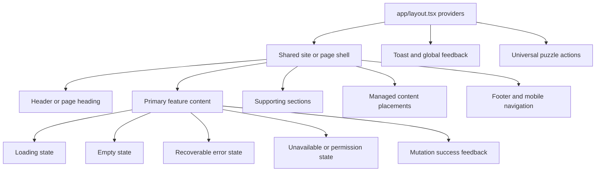

Every visible route and CTA must resolve. Shared shells, tokens, controls, and states are defined in [CODING-STANDARDS.md](./CODING-STANDARDS.md).

## 4. Puzzle dependency graph

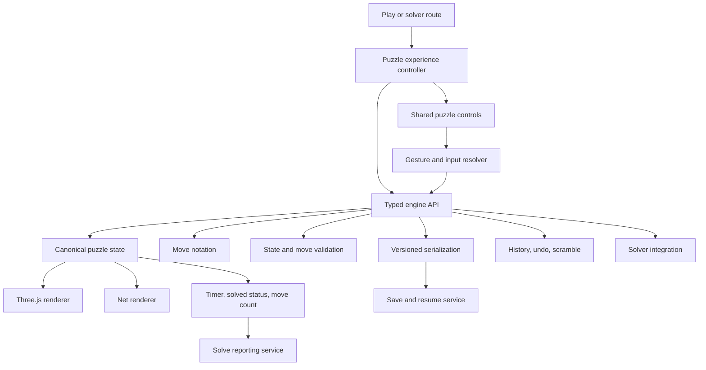

The engine is the source of puzzle truth. Renderers display state; they do not maintain a competing permutation model. The approved 3×3 interaction is the reference behavior. See [CUBE-ENGINE.md](./CUBE-ENGINE.md), engine-specific notes, and engine tests under `tests/`.

## 5. Puzzle family and reuse graph

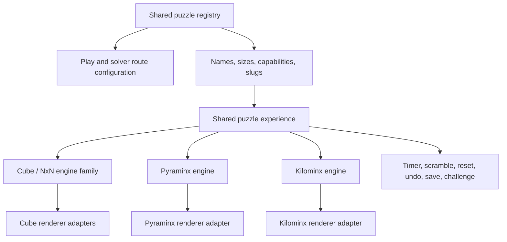

New puzzles extend the registry, engine contract, renderer adapter, tests, and route configuration. Do not clone a complete game page. Cross-reference [CUBE-ENGINE.md](./CUBE-ENGINE.md), `lib/cube-engine.ts`, `lib/nxn-cube.ts`, `lib/nxn-fast.ts`, `lib/pyraminx-engine.ts`, `lib/kilominx-engine.ts`, and related tests.

## 6. Authentication and Cube ID flow

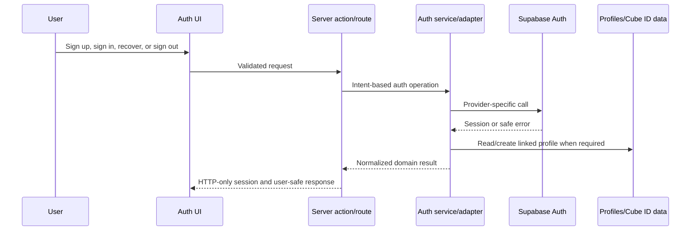

Provider details stay isolated and recovery redirects must be allowlisted. See [AUTHENTICATION.md](./AUTHENTICATION.md), [SECURITY.md](./SECURITY.md), and [BACKUP-AND-MIGRATION.md](./BACKUP-AND-MIGRATION.md).

## 7. Solve, scramble, challenge, and leaderboard flow

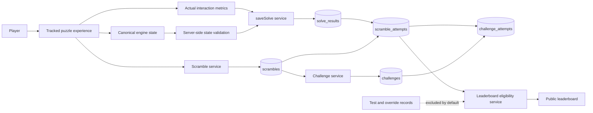

Actual and reported/test metrics remain separate. Public ranking eligibility is a server decision. See [SOCIAL-AND-MULTIPLAYER.md](./SOCIAL-AND-MULTIPLAYER.md), [SECURITY.md](./SECURITY.md), current checkpoints, and leaderboard handoff material.

## 8. Managed ads and affiliate content flow

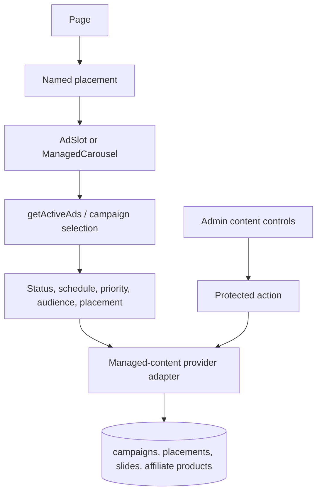

Pages reference placements; they do not hard-code campaign content. See [ADS-AFFILIATES.md](./ADS-AFFILIATES.md), [ADMIN-PORTAL.md](./ADMIN-PORTAL.md), and campaign selection tests.

## 9. Admin security dependency graph

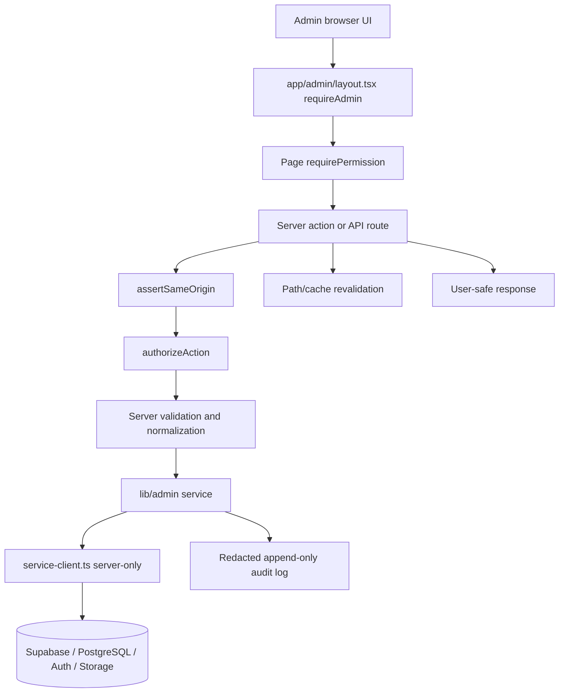

The browser is never trusted for privilege. Authorization lives in `admin_members`, service-role credentials are server-only, and failures close safely. See [ADMIN-PORTAL.md](./ADMIN-PORTAL.md), [ADMIN-GUIDE.md](./ADMIN-GUIDE.md), [SECURITY.md](./SECURITY.md), and ADR 0003.

## 10. State ownership graph

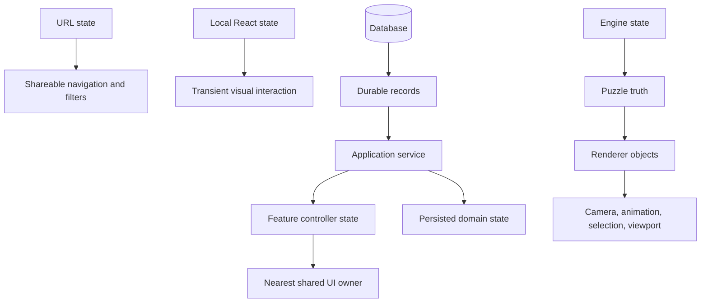

Do not mirror one source of truth across React state, render objects, engine state, and persistence without a documented synchronization contract.

## 11. Testing and proof dependency graph

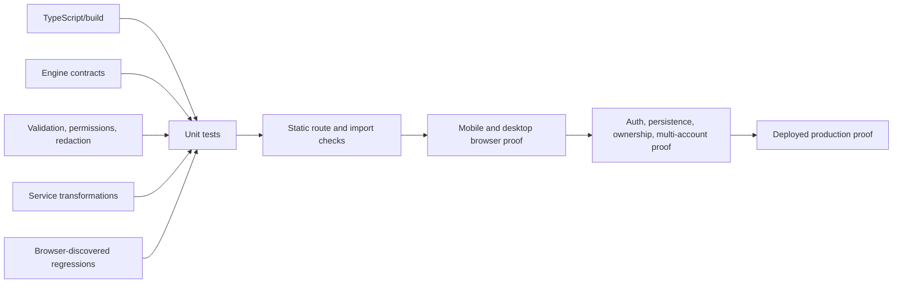

A lower proof level never establishes a higher one. See [CODING-STANDARDS.md](./CODING-STANDARDS.md), [PROJECT-HEALTH.md](./PROJECT-HEALTH.md), [DAILY-LOG.md](./DAILY-LOG.md), and `tests/`.

## 12. Change and context-rot control graph

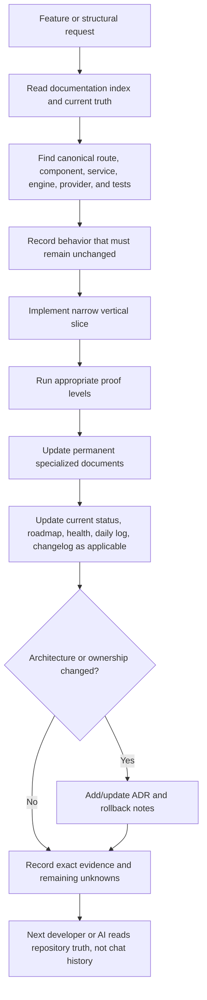

See [AI-INSTRUCTIONS.md](./AI-INSTRUCTIONS.md), [README.md](./README.md), [CODING-STANDARDS.md](./CODING-STANDARDS.md), and [checkpoints/](./checkpoints/).

## 13. Import-direction rules

Allowed direction:

```text
app routes/layouts
  -> feature controllers/components
    -> shared components/hooks/types
      -> application/domain services
        -> engines and pure domain modules
        -> provider adapters/server-only clients
          -> external systems
```

Forbidden examples:

- provider adapter importing a page or React component;
- engine importing UI, auth, ads, database, or navigation;
- shared component importing a route-specific page module;
- visual component importing service-role or privileged Supabase code;
- feature A deep-importing feature B internals;
- renderer mutating canonical puzzle state independently;
- route file becoming a second service, engine, or design system.

## 14. Living-graph maintenance rules

Update this document when any of these change:

- a new architectural layer, provider, engine family, major data domain, or shared state owner is introduced;
- an existing dependency direction changes;
- a route family or feature flow becomes canonical;
- authentication, authorization, persistence, managed content, or public ranking flow changes;
- a diagram no longer matches the code.

For every graph change:

1. update the specialized permanent document first;
2. update this visual map;
3. add an ADR when the change is structural or difficult to reverse;
4. update current-status and evidence documents as required by [README.md](./README.md);
5. preserve historical checkpoints rather than rewriting them as current truth.

## 15. Automated graph generation target

The Mermaid diagrams above are curated architectural intent. They should eventually be supplemented by generated evidence:

- TypeScript import graph with circular-dependency detection;
- route inventory and broken-link check;
- package dependency audit;
- database relationship diagram generated from migrations/schema;
- test-to-module coverage map;
- client/server boundary check;
- forbidden-import boundary check.

Generated graphs report what the code currently does. This document reports what the architecture permits. A mismatch is a defect to investigate, not a reason to silently edit the intended architecture.
